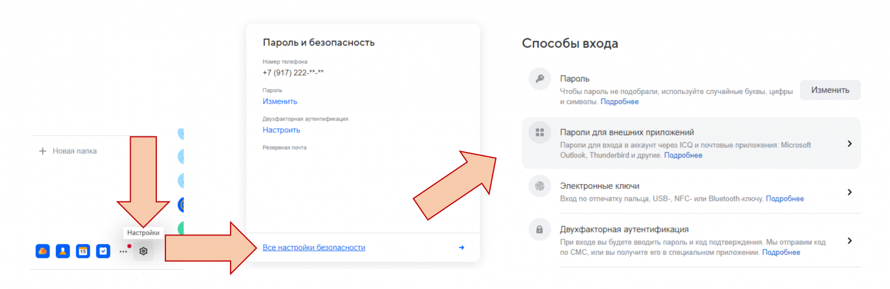

export DJANGO_DEBUG=0  
export DJANGO_SECRET_KEY=your_django_sec_key  
export DJANGO_ALLOWED_HOSTS=localhost 127.0.0.1 [::1]  
export POSTGRES_HOST=db  
export POSTGRES_PORT=5432  
export POSTGRES_USER=your_pg_user  
export POSTGRES_PASSWORD=your_pg_pass  
export POSTGRES_DB=crm  
export NGINX_EXTERNAL_PORT=80  
export DATABASE=postgres  
export ONEC_DB_HOST=ip_of_your_1c_zarplata_i_kadri_db_(ms sql)  
export ONEC_DB=name_of_1c_db(sql)  
export MIS_DB_HOST=tcp:your_tm_mis_db_ip,your_tm_mis_db_port  
export IS_DB=dbname_tm_mis  
export DB_USER=username_tm_mis_db # **from installation step 3** 
export DB_PASS=userpass_tm_mis_db # **from installation step 3** 
export ENC=no  
export USE_LDAP = 1 # **- if you have and want to use LDAP for AUTH users, else set this to "0" and leave the following 6 fields blank** 
export AUTH_LDAP_SERVER_URI = "ldap://yourdomain" (or your PDC)  
export AUTH_LDAP_BIND_DN = "user@domain" # user who can get data from domain  
export AUTH_LDAP_BIND_PASSWORD = "pass" # user pass who can get data from domain  
export AUTH_LDAP_ROOT_DN = "DC=example,DC=ru"  
export AUTH_LDAP_USERS_OU = "OU=ГБУЗ АО БГКБ" # ou which users can get access to MedItCRM  
export AUTH_LDAP_SU_CN = "CN=Admins,CN=Users" # this group become superuser in MedItCRM  
export MAIL_USER = "user@domain.ru" #user from mail.ru mailbox  
export MAIL_PASS = "secret_key_for_external_app" # **look at pic.** 
export IMAP_SERVER = "imap.mail.ru"  
